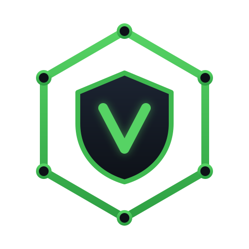

<p align="center">
  
</p>

# ViltrumX

**The Security Decision OS for India's Startup Economy.**

> *Most tools display alerts. ViltrumX makes governed decisions — grounded in your world,
> proven every night, understood in your language.*

This README is the complete map of the project: what it is, why it exists, what it actually
does, how every piece fits together, what's already built, and what gets built next. Deeper
documents are indexed at the [bottom](#12-docs-index).

---

## 1. What is this, in plain words?

Picture **PayKraft** — a fictional 40-person fintech startup in Bengaluru. It has real things
worth stealing: a customer database, AWS keys, payment rails. It has **zero security staff**.
Nobody is watching dashboards at 3 AM, and nobody at the company would understand them anyway.

At **3:11 AM**, someone logs into developer Priya's Google account from a Moscow IP. Within
minutes they use her GitHub personal-access token to read a private repo, find an AWS key
committed inside it, and start copying the customer database out of S3.

Without ViltrumX: nothing happens, or an alert email nobody reads, or a very bad phone call
weeks later.

**With ViltrumX, this happens automatically in about a minute:**

1. The login event lands in the pipeline and gets stitched into a **live graph of the
   company's world** — "Priya authenticates from a new Moscow device."
2. Local ML models score it: **impossible travel, anomaly 0.94**.
3. An investigation agent **walks the graph** outward and reconstructs the full chain:
   login → GitHub token → repo → leaked AWS key → S3 bucket — which the founder tagged as a
   **crown jewel** during onboarding, so the system knows this is the customer database, not
   just "a bucket."
4. A critic agent tries its best to prove the finding is a false alarm — and fails.
5. The response agent proposes four actions, and the **autonomy policy** decides each one's
   fate: revoke Priya's session (low blast radius → **done automatically**), rotate the AWS
   key (**done**), block the IP for one hour (**done, self-reverting**), disable Priya's
   account entirely (high impact on a real human → **proposed only, waits for approval**).
6. The founder's phone shows — in **Hindi, Gujarati, or English**, in plain words, with the
   impact in **rupees** — what happened, what was already contained, and the one decision that
   needs a human. One tap approves or rejects it; the choice becomes training data.
7. Every step was recorded in an append-only **provenance trace**. Any action can be replayed
   and **undone with one click**.
8. That night, the platform **replays the same attack against itself** to prove it would still
   be caught, and updates a Defense Readiness Score.
9. When CERT-In requires an incident report within its 6-hour window, the evidence pack is
   **generated from the trace** — not typed up by a panicking founder at 4 AM.

That story — *log line in, governed decision out, explained in the founder's own language,
provable and reversible* — is the entire product. Everything in this repository exists to make
exactly one such story (incident **INC-042**) run live, end to end, in front of an examiner.

---

## 2. Why build it — and why India-first?

Three facts about the 2026 "autonomous SOC" market shape every choice here:

1. **"AI triages your alerts" is table stakes now.** 20+ funded vendors and every incumbent
   (CrowdStrike, Palo Alto, Microsoft, Google) already say it. That pitch wins nothing.
2. **The real blocker to autonomy is trust, not capability.** No founder lets an AI disable
   their CTO's account on a hunch. Autonomy has to be graduated, reversible, and auditable —
   and even that is now an expected feature, not a moat by itself.
3. **The genuinely underserved buyer is the Indian startup** with a real attack surface and
   zero analysts: paying in rupees, invoiced with GST, subject to the DPDP Act 2023, CERT-In's
   6-hour breach-reporting mandate, and RBI cybersecurity rules — often run by founders who
   don't think in English. Existing AI-SOC products are priced for US/EU enterprises
   ($36K–$100K+/yr) and speak only English. SMB-tier early movers exist (Bricklayer,
   UnderDefense), but they are US/EU-market too — **our edge is India compliance + language +
   price, not a first-mover claim.**

The wedge, in one line: **an ontology-grounded, governed-autonomy SOC, built and priced for
the Indian startup, that proves itself nightly and speaks the founder's language.**

Who it's for: seed → Series-B Indian startups (20–300 people) with no security team but a real
attack surface — Google Workspace, GitHub, AWS/GCP, Razorpay, and increasingly their own AI
features.

---

## 3. The core idea — Palantir's playbook, borrowed openly

We use the same operating model Palantir built Foundry/Gotham on (they apply it to
cybersecurity themselves; we say that plainly instead of pretending to have invented it).
The entire system rests on three primitives:

| Primitive | Plain meaning | Examples |
|---|---|---|
| **Objects** | The *nouns* of the company, as typed graph nodes | `User`, `ServiceAccount`, `APIKey`, `Device`, `Repo`, `CloudResource`, `DataAsset`, `Alert`, `Incident` |
| **Links** | The *verbs* connecting them, as typed edges | `authenticates_to`, `has_access_to`, `owns`, `member_of`, `escalated_to`, `exfiltrated_from` |
| **Actions** | The **only** way anything gets changed — typed, governed write-backs | `revoke_session`, `force_mfa`, `rotate_key`, `block_ip`, `disable_identity`, `quarantine_device` |

This graph — **the ontology**, living in Neo4j — is the shared world-model every agent reads
and acts on. Two properties make it the actual moat:

- **Business criticality on every object.** During onboarding, the founder tags what actually
  matters (`Low / Medium / High / Crown-Jewel`). "This S3 bucket is the customer database" is
  knowledge no log file contains — and it's what lets the system reason about *impact in
  rupees* instead of technical severity.
- **Every Action is governed.** An Action carries preconditions, a **blast-radius score**
  (computed on the graph, weighted by the criticality of everything reachable from the target),
  a rollback plan, and a provenance record. Agents get no backdoor: they request Actions
  through the same governed API a human would use.

The payoff: lateral movement, blast radius, and attack paths stop being hand-written detection
heuristics and become **graph queries**.

---

## 4. The trust machinery — the L1–L4 autonomy ladder

The founder controls how autonomous the system may be — per action type, per tenant — through
a versioned policy object called **the dial** (edited in the Autonomy Console; every change is
itself audited):

| Tier | Behavior | Example | Reversibility |
|---|---|---|---|
| **L1** | Always automatic | Build a timeline, geolocate an IP | Read-only |
| **L2** | Automatic + notify | Revoke one session, force MFA | Trivial |
| **L3** | Automatic + timed auto-rollback | Block an IP for 1 hour, then self-review | Self-reverting |
| **L4** | Propose only — human approves | Disable an exec account, quarantine prod | Human-gated |

One hard override sits above the dial: **if a crown-jewel object is within 2 hops of the
action's target, the action is forced to L4** regardless of policy. Graduated autonomy is an
expected feature in this market — the job is to build it transparently and provably well.

---

## 5. The 8 agents — less magic than they sound

An "agent" here is **a Python function that takes a shared state dict, does one job, and
returns the dict with its findings added**. LangGraph is just the thing that runs those
functions in the right order — a flowchart-runner passing a baton. Only **one** agent (#8)
ever calls an LLM. Detection is always local, deterministic ML.

| # | Agent | One job | Viva depth |
|---|---|---|---|
| 1 | Ontology Sync | Turn raw log lines into graph nodes and edges | Full |
| 2 | Noise-Gate | Cluster near-duplicate alerts — 50 alerts in, 1 out | ML pipeline stage |
| 3 | Threat Prediction | Forecast risk before impact | Scheduled scoring job |
| 4 | Detection | Score events with the trained ML models | Full |
| 5 | Investigation | Walk the graph, build the attack chain, map steps to MITRE ATT&CK, recall similar past incidents from vector memory | Full |
| 6 | Verification Critic | Adversarially try to refute the finding; only survivors reach response | Working, narrow |
| 7 | Response Commander | Propose Actions; let the policy gate assign L1–L4; execute or await approval | Full |
| 8 | Explainability | Write the narrative (the only LLM call), render EN/HI/GU, compute Founder Mode ₹ view | Working, narrow |

**The closed feedback loop:** every human override — approve, reject, rollback — is stored as
a labeled training signal and folded into the next model retrain, so the system learns each
company's definition of "false alarm."

---

## 6. From log line to decision — where each stage lives in the code

| # | Stage | Plain words | Code home |
|---|---|---|---|
| 1 | Ingest | Receive or replay logs (Google Workspace, AWS CloudTrail, GitHub formats) | `backend/connectors/` |
| 2 | Resolve | Stitch each line into the graph as Objects + Links | `backend/ontology/` → Neo4j |
| 3 | Noise-gate | Collapse duplicate alerts (HDBSCAN clustering) | `backend/detection/` |
| 4 | Detect | Score anomalies (Isolation Forest) and true-vs-false-positive risk (XGBoost) | `backend/detection/` |
| 5 | Investigate | Walk the graph, build the chain, MITRE-map, recall precedents | `orchestrator/` (agent 5) |
| 6 | Verify | The critic tries to refute the finding | `orchestrator/` (agent 6) |
| 7 | Respond | File a governed Action; the dial decides L1–L4 | `backend/actions/` |
| 8 | Record | Append-only provenance trace; one-click rollback | `backend/actions/` |
| 9 | Explain | Narrative + Hindi/Gujarati + ₹ impact — **the only LLM stage** | `backend/reports/` |
| 10 | Prove | Nightly self-attack replay → Defense Readiness Score | purple-team Celery job |

### The services

```
React + TypeScript SPA (13 screens — built, on mock data)
   │  REST /api/v1 (JWT)                │  WebSocket /ws (live agent feed)
   ▼                                    ▼
Django + DRF backend   ◄── internal API ──   Orchestrator (LangGraph — the 8 agents)
   │
   ├── PostgreSQL — system of record: tenants, incidents, actions, audit, billing
   ├── Neo4j      — the ontology graph: objects, links, attack paths, blast radius
   ├── Qdrant     — vector memory: "have we seen something like this before?"
   └── Redis      — the messenger: Celery queue, event stream, WebSocket pub/sub
```

**Why four data stores?** Each answers a different question. Postgres: *what is true* — facts
that must never be wrong. Neo4j: *what connects to what* — attack paths are graph walks, not
SQL joins. Qdrant: *what does this resemble* — similarity search over past incidents. Redis:
*what just happened* — queues and live streams, nothing permanent.

**The LLM is a plug, not a pillar.** `reports/llm.py` exposes one interface with two backends:
Groq (cloud API, default) or self-hosted Ollama (sovereign mode — nothing leaves the machine,
which matters under DPDP). The prompt only ever contains verified facts — the ontology
snapshot, the attack chain, provenance entries. The LLM sits *after* every decision, never
before it, so a hallucinated sentence cannot fire an action.

---

## 7. The 13 screens (React + TypeScript — all built)

One marketing landing page + 12 product screens (the rubric requires 10+ product screens).

| Story they tell | Screens |
|---|---|
| **See your world** | Command Deck (live mission control) · Ontology Explorer (the graph, crown jewels highlighted) · Attack Surface Inventory · Risk & Prediction Dashboard (with Founder Mode toggle) |
| **Decide & trust** | Investigation Workspace (attack chain, evidence, AI narrative in EN/हिंदी/ગુજરાતી) · Autonomy Console (the L1–L4 dial) · Provenance / Audit Viewer (replay any decision, one-click undo) |
| **Prove & comply** | Purple Team Console (nightly self-attacks, readiness score) · Report & Compliance Center (DPDP · CERT-In · RBI · SOC 2 evidence exports) |
| **Run the account** | Login/Auth · Onboarding & Integrations Wizard (connect sources, tag crown jewels) · Settings / RBAC / Billing (INR + GST) |
| **Marketing** | Landing page |

---

## 8. What's real today vs. what's next

| Piece | Status | Built by |
|---|---|---|
| Frontend — all 13 screens, running on mock data (`frontend/src/data/mock.ts`) | ✅ done | Claude |
| Backend shell — Django project (7 apps), JWT auth, every v1 endpoint live on demo fixtures, 11 contract tests, `seed_demo` command | ✅ done | Claude |
| CI/CD — 4 GitHub workflows, Docker Compose local + staging, pre-commit hooks | ✅ live | Claude |
| Backend real logic — DB models, policy gate, Neo4j sync, connectors, ML | ⬜ Weeks 1–3 | Yuvraj (Claude reviews) |
| Orchestrator — the 8 agents (LangGraph) | ⬜ Week 3 | Yuvraj + Claude pairing |
| LLM narratives, Hindi/Gujarati rendering, purple team, compliance PDFs | ⬜ Week 4 | Yuvraj (Claude pairs on wiring) |

### How fake becomes real — the one trick to internalize

The frontend was built *first*, against mock data — and those mock shapes are **the API
contract**. `frontend/src/data/mock.ts` and `backend/core/demo_data.py` are mirror images.
Every stub view in `backend/core/views.py` carries a `# WEEK n:` comment saying exactly what
replaces it, and the 11 contract tests fail loudly if a response shape drifts.

The work is never "start from a blank file." It is always: **replace one marked stub with a
real queryset or graph call → keep the tests green → watch that screen stop being fake.** A
screen is done when flipping it from mock to live API changes nothing visible.

---

## 9. Quick start

**Frontend demo (no Docker needed):**

```bash
cd frontend && npm install && npm run dev   # → http://localhost:5173
```

**Full stack in containers:**

```bash
cp .env.example .env          # fill in GROQ_API_KEY (needed from Week 4)
docker compose up -d          # Postgres 16 · Neo4j 5 (+GDS) · Qdrant · Redis 7 · backend
# Neo4j browser → http://localhost:7474
```

**Backend hands-on (development):**

```bash
cd backend
python3 -m venv .venv && source .venv/bin/activate
pip install -r requirements.txt
python manage.py migrate && python manage.py seed_demo
python manage.py runserver    # → http://localhost:8000/api/v1/
# demo login: arjun.mehta@paykraft.in / viltrumx-demo
pytest .                      # 11 contract tests — keep these green
```

**Repository layout:**

```
viltrumx/
├── frontend/            # React + TS SPA — 13 screens (done, on mock data)
├── backend/             # Django + DRF — 7 apps; stub API live, real logic lands week by week
├── orchestrator/        # LangGraph service — the 8 agents (Week 3)
├── docs/                # ARCHITECTURE.md · BUILD-PLAN.md
├── .github/workflows/   # frontend CI · backend CI · build + Trivy scan · gated deploy
├── docker-compose.yml   # Postgres · Neo4j(+GDS) · Qdrant · Redis · backend
└── branding/            # mark, wordmark, brand guide
```

**Environments:** local (`docker compose up`) → staging (merge to `develop`, seeded demo
tenant) → production (tag `v*`, manual approval via GitHub Environment protection).

---

## 10. Build order — ledger, map, brain, voice

The step-by-step checklist lives in [`docs/BUILD-PLAN.md`](./docs/BUILD-PLAN.md).

| Week | Nickname | What gets real | Screens that go live |
|---|---|---|---|
| 1 | **The ledger** | Postgres models — incidents, actions, provenance, the dial, audit — plus the `resolve_level` policy-gate function | Command Deck, Provenance, Autonomy, Settings |
| 2 | **The map** | The Neo4j graph + the synthetic log generator + one real connector (GitHub) | Ontology Explorer, Inventory, Onboarding |
| 3 | **The brain** | ML models (Isolation Forest, XGBoost, HDBSCAN) + the 4 core agents | Investigation, Risk, live Command Deck |
| 4 | **The voice** | LLM narratives, Hindi/Gujarati, nightly purple team, CERT-In evidence pack | Narratives, Purple Team, Reports |

Agents come **last on purpose**: Investigation needs a graph to walk (Week 2) and Response
Commander needs governed Actions to file (Week 1). Build the foundation first and the agents
plug into things that already work.

Every week ends the same way: **CI green · `seed_demo` works · click through the new screens.**

### Lost? The re-entry checklist

1. **Run it.** `docker compose up -d`, then `runserver`, log in as
   `arjun.mehta@paykraft.in`, click around. Seeing it work resets context faster than reading.
2. **Open the worklist.** `backend/core/views.py` — every stub is marked `# WEEK n:` with
   exactly what replaces it.
3. **Do the next unchecked box** in [`docs/BUILD-PLAN.md`](./docs/BUILD-PLAN.md) — only the
   *current* week's list, one box at a time.

**The very first thing to write** (Week 1, box 2): a pure Python function
`resolve_level(action_type, target_criticality, policy) -> "L1".."L4"` in `actions/`, with
5–6 unit tests written first. No Django, no database, no imports — just a function and its
tests. That's the entry point. Everything else in Week 1 builds on it.

---

## 11. Honest limits

- Synthetic data is not production noise; detection metrics are demonstrative, not benchmarked.
- One real connector (GitHub); other sources run on replayed real-format logs — identical
  architecture, less breadth.
- Continuous purple-teaming closes a loop few platforms close — but not none (Simbian ships
  it too). We never claim "nobody does this."
- AI-agent / non-human-identity security is currently the hottest, most-funded niche in the
  industry. It is on our roadmap, not in this build, and we claim no lead there.
- Neo4j Community on a single node is right-sized for startup-scale graphs, not enterprise scale.
- Autonomy liability is *mitigated* (dial + rollback + provenance), not eliminated.
- The LLM narrative path depends on Groq's free tier unless sovereign mode (local Ollama) is
  toggled.

---

## 12. Docs index

| Question | File |
|---|---|
| What are we building and why? Product truth, positioning, claims we may and may not make | [`CLAUDE.md`](./CLAUDE.md) |
| How does the system work? Design, data model, agent graph, API contract | [`docs/ARCHITECTURE.md`](./docs/ARCHITECTURE.md) |
| What do I build next, in what order, and what can I cut? | [`docs/BUILD-PLAN.md`](./docs/BUILD-PLAN.md) |
| How do I run and develop the backend? | [`backend/README.md`](./backend/README.md) |
| The map of everything | this file |

---

## 13. License & ownership

ViltrumX is **not open source**. The concept, product design, architecture, brand identity
(including the hexagon-shield mark), and this codebase are the exclusive property of Yuvraj.
Collaborators contribute under the terms of the [`LICENSE`](./LICENSE): contribution earns
authorship credit for the code written, not ownership of the project or the idea. No copying,
redistribution, or derivative use without prior written permission.
