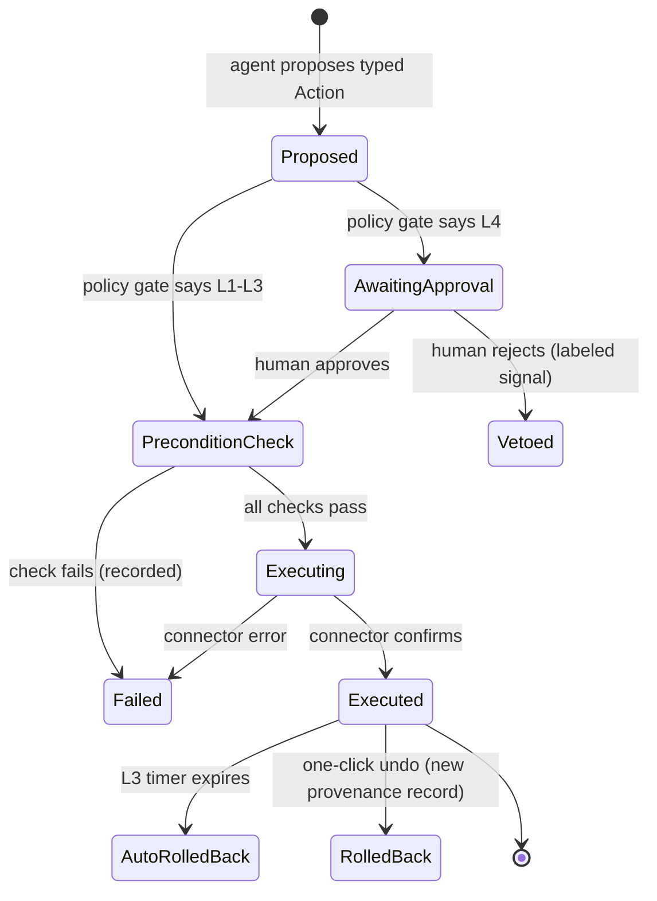
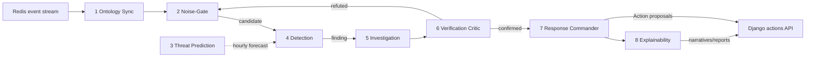
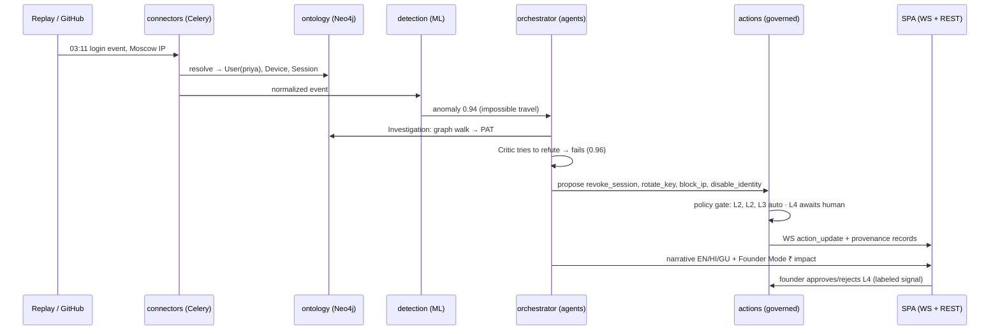

# ViltrumX — System Architecture & Design

> **Status:** Frontend (13 screens) built and approved · Backend + agents in build (see
> [`BUILD-PLAN.md`](./BUILD-PLAN.md)) · Product spec in [`CLAUDE.md`](../CLAUDE.md)

---

## 1. Design principles

1. **Ontology-grounded.** Every alert, decision, and report references typed objects and links
   in a graph — never free-floating log lines. The graph *is* the shared context all agents act on.
2. **ML detects; LLMs only explain.** Detection is local, deterministic, and cheap (scikit-learn /
   XGBoost served from joblib). The LLM sits exclusively on the explanation path and can be swapped
   per tenant (Groq API ↔ self-hosted Ollama) without touching detection.
3. **Governed autonomy.** No agent mutates the customer's world except through a typed `Action`
   with preconditions, a blast-radius score, a rollback plan, and an immutable provenance record —
   gated by the per-tenant L1–L4 policy dial.
4. **Contract-first.** The frontend was built first on mock data; the shapes in
   `frontend/src/data/mock.ts` are the API contract (§10). The backend's job is to make those
   shapes real, screen by screen.
5. **Tenant-scoped everything.** Every row, node, queue message, and WebSocket group carries a
   tenant id. One codebase, many isolated startups.

---

## 2. System overview

```
                      ┌────────────────────────────────────────────────┐
                      │            React + TypeScript SPA              │
                      │      12 product screens + landing  [DONE]      │
                      └──────────┬─────────────────────────┬───────────┘
                                 │ REST /api/v1 (JWT)      │ WebSocket /ws (Channels)
                      ┌──────────▼─────────────────────────▼───────────┐
                      │              Django + DRF backend              │
                      │  core: tenancy · RBAC · audit    actions: gov. │
                      │  ontology: graph sync            reports: LLM  │
                      │  connectors: ingest              billing: INR  │
                      │  detection: ML serving                         │
                      └───┬─────────────┬──────────┬──────────┬────────┘
              Celery jobs │             │          │          │ internal API + Redis pub/sub
                      ┌───▼───┐   ┌─────▼────┐  ┌──▼────┐  ┌──▼────────────────┐
                      │ Redis │   │ Postgres │  │ Neo4j │  │   Orchestrator    │
                      │ queue │   │ system   │  │ the   │  │   (LangGraph)     │
                      │ + pub │   │ of record│  │ontology│ │   8 agents        │
                      └───────┘   └──────────┘  └──┬────┘  └──┬─────────┬──────┘
                                                   │          │         │
                                              ┌────▼───┐ ┌────▼─────┐ ┌─▼──────────────┐
                                              │ Qdrant │ │ ML models│ │ LLM adapter    │
                                              │ memory │ │ (joblib) │ │ Groq / Ollama  │
                                              └────────┘ └──────────┘ └────────────────┘

  Event sources → connectors:
    • Synthetic log replay (primary demo path — Workspace/CloudTrail/GitHub formats as JSONL)
    • GitHub (the one REAL connector: webhooks + audit-log polling)
```

### Component responsibilities

| Component | Owns | Never does |
|---|---|---|
| **React SPA** | All UX, autonomy dial UI, language/Founder Mode rendering | Business logic, scoring |
| **Django `core`** | Tenants, memberships, RBAC, JWT auth, append-only audit log | — |
| **Django `connectors`** | Source ingestion: webhook receivers, pollers, synthetic replay | Detection logic |
| **Django `ontology`** | Entity resolution; sync of Objects/Links to Neo4j; criticality tags | — |
| **Django `detection`** | Serving trained models; scoring pipelines (Celery) | Calling any LLM |
| **Django `actions`** | Governed Action lifecycle, policy gate, rollback, provenance | Bypassing the dial |
| **Django `reports`** | LLM-grounded narratives, IndicTrans2 rendering, compliance packs | Detection |
| **Django `billing`** | INR plans, GST invoices, Razorpay/UPI (stub-tier for viva) | — |
| **Orchestrator** | LangGraph state machine coordinating the 8 agents | Direct DB writes (goes via API) |
| **Postgres** | System of record: tenants, incidents, actions, audit, billing | Graph queries |
| **Neo4j (+GDS)** | The ontology: objects, links, attack paths, blast radius | Billing/auth data |
| **Qdrant** | Vector memory: "seen this before?" incident recall | — |
| **Redis** | Celery broker, event stream, Channels pub/sub | Persistence |

---

## 3. The pipeline — from raw log to governed decision

```
 stage                # app / service          # output
 1. Ingest            connectors (Celery)      normalized events on Redis stream
 2. Resolve           ontology                 Objects/Links upserted in Neo4j (+Postgres refs)
 3. Noise-gate        detection + orchestrator HDBSCAN clusters; ~97% suppressed
 4. Detect            detection (ML)           anomaly/risk scores (IF, XGBoost, peer-cohort)
 5. Investigate       orchestrator (agent 5)   attack chain = graph path + MITRE mapping
 6. Verify            orchestrator (agent 6)   adversarial critic must fail to refute
 7. Respond           actions                  governed Action per the L1–L4 dial
 8. Record            actions                  immutable provenance trace + audit event
 9. Explain           reports (LLM)            narrative EN/HI/GU + Founder Mode ₹ impact
10. Prove             purple-team job          nightly self-attack → readiness score
```

Feedback loop: every human override (approve/reject/rollback) is stored as a labeled training
signal and folded into the next Noise-Gate/Detection retrain for that tenant.

---

## 4. Ontology model (Neo4j)

**Node labels** — `User`, `ServiceAccount`, `APIKey`, `Device`, `CloudResource`, `Repo`,
`SaaSApp`, `DataAsset` (+ security objects `Alert`, `Incident`, `AttackPath` referenced from
Postgres by id). Every node carries:

```
{ tenant_id, external_id, label, business_criticality: LOW|MEDIUM|HIGH|CROWN_JEWEL,
  risk_score: float, first_seen, last_seen, compromised: bool }
```

**Relationship types** — `AUTHENTICATES_TO`, `HAS_ACCESS_TO`, `OWNS`, `MEMBER_OF`,
`COMMUNICATES_WITH`, `ESCALATED_TO`, `EXFILTRATED_FROM`, `IMPERSONATES`, `CONTAINS`, `LEAKED_IN`.

**Blast radius** (what the Autonomy gate consumes) — reachable crown-jewel weight from a target
node:

```cypher
MATCH (t {external_id: $target, tenant_id: $tid})
MATCH p = (t)-[:HAS_ACCESS_TO|AUTHENTICATES_TO|OWNS*1..4]->(a)
WITH a, min(length(p)) AS hops
RETURN sum( CASE a.business_criticality
              WHEN 'CROWN_JEWEL' THEN 1.0 WHEN 'HIGH' THEN 0.5
              WHEN 'MEDIUM' THEN 0.2 ELSE 0.05 END / hops ) AS raw_blast
```

Normalized to 0–1; **any crown jewel within 2 hops forces the L4 policy override** regardless of
the numeric score. Attack-path discovery and centrality use Neo4j GDS (shortest-path, PageRank).

---

## 5. Governed Action lifecycle



**Policy resolution** (the Autonomy Console edits this): `level = policy[action_type]`, then
`level = max(level, crown_jewel_override)` if the target or its 2-hop blast set contains a crown
jewel. The policy is itself a versioned object — changing the dial is an audited event.

**Provenance record** (what the Provenance Viewer replays): trigger + confidence, each
precondition check with result, blast-radius inputs, policy version consulted, execution
API call + latency, notification fan-out, rollback plan. Append-only; rollbacks are new records
pointing at the original, so audits see both directions.

---

## 6. Agent architecture (LangGraph)



- The orchestrator is a **separate service** (`orchestrator/`). It consumes the tenant event
  stream from Redis, holds LangGraph state per incident, and talks to Django through an internal
  service-token API — it never writes to Postgres/Neo4j directly, so every mutation passes the
  same governance code path a human request would.
- **Investigation** is tool-use over the ontology: graph queries, GeoIP, MITRE ATT&CK mapping,
  Qdrant recall of similar past incidents ("INC-041, similarity 0.83").
- **Verification Critic** runs adversarially: it gets the finding and must construct a benign
  explanation; only findings that survive go to Response. Its verdict + rationale land in
  provenance.
- Viva-tier scope: agents 1, 4, 5, 7 fully working; 2 as an ML pipeline stage; 6 and 8 working
  but narrow; 3 as a scheduled scoring job (see BUILD-PLAN drop-order).

---

## 7. ML stack & the cold-start answer

| Job | Algorithm | Trained on |
|---|---|---|
| Login/access anomaly | Isolation Forest (+LOF) | synthetic baseline traffic |
| Alert true/false-positive scoring | XGBoost | synthetic labeled attacks + overrides |
| Alert clustering / noise-gate | HDBSCAN | live alert stream |
| Peer-cohort anomaly (UEBA) | z-scores per cohort | rolling window stats |
| Attack path / blast radius | Neo4j GDS | the ontology itself |
| Incident recall | sentence-transformers → Qdrant | closed incidents |

**Cold start:** a **synthetic log generator** produces (a) weeks of baseline-normal traffic for a
fictional tenant and (b) scripted attack chains (impossible-travel → PAT abuse → S3 exfil, etc.)
in real Workspace/CloudTrail/GitHub log formats. The same generator is the **Purple Team
engine** — nightly it replays an attack against the live pipeline and scores
detection/containment time into the Defense Readiness Score. Training data, demo trigger, and
trust proof are one subsystem.

---

## 8. LLM explanation layer (provider-agnostic)

```
reports/llm.py  →  LLMClient (one interface)
                     ├── GroqProvider    (langchain-groq, GROQ_API_KEY)   ← default
                     └── OllamaProvider  (langchain-ollama, local llama3.1:8b) ← sovereign mode
```

- Provider is a **per-tenant setting** (`tenant.llm_provider`), demoing pillar 5: flip to
  self-hosted and no telemetry leaves the machine. Groq's free tier covers the whole project;
  local Ollama on Apple Silicon covers the sovereign demo. A remotely-hosted Ollama is
  deliberately not offered — it is just another cloud API and defeats the pillar.
- **Grounding rule:** the prompt contains only verified facts — the ontology snapshot, the attack
  chain, provenance entries — and the output is a narrative *about* them. The LLM never sees raw
  logs, never scores, never triggers actions. A hallucinated sentence cannot fire a response.
- **Multilingual:** narrative is generated in English, then rendered to Hindi/Gujarati via the
  IndicTrans2 pipeline (reused from CrimeGPT) — not by asking the LLM to translate. Founder Mode
  is a second grounded prompt over the same facts plus the ₹-impact figures computed in Python.

---

## 9. Realtime (Django Channels)

- One WebSocket group per tenant: `ws/tenant/{id}/stream`, fed by Redis pub/sub.
- Event types (all consumed by the already-built Command Deck): `agent_status`, `feed_line`,
  `incident_update`, `action_update`, `readiness_update`.
- REST remains the source of truth; the socket is a cache-invalidation hint + live feed.

---

## 10. API contract v1 (screens ↔ endpoints ↔ mock shapes)

JWT via `POST /api/v1/auth/token` (SimpleJWT). All routes tenant-scoped. Response shapes are
defined by `frontend/src/data/mock.ts` — serializers must match them field-for-field.

| Screen (built) | Endpoints | Mock shape |
|---|---|---|
| Command Deck | `GET /agents/status` · `GET /incidents` · WS stream | `AGENTS`, `INCIDENTS`, `ACTIVITY_FEED` |
| Ontology Explorer | `GET /ontology/graph` · `GET /ontology/objects/{id}` | `ONT_NODES`, `ONT_EDGES` |
| Investigation | `GET /incidents/{id}` · `GET /incidents/{id}/narrative?lang=&mode=` | `ATTACK_CHAIN`, `EVIDENCE`, `NARRATIVE` |
| Autonomy Console | `GET/PUT /policies` | policy matrix |
| Provenance | `GET /actions` · `GET /actions/{id}/trace` · `POST /actions/{id}/rollback` | `ACTIONS`, `PROVENANCE_TRACE` |
| Risk & Prediction | `GET /risk/trend` · `GET /risk/entities` · `GET /risk/readiness` | `RISK_TREND`, `ENTITY_RISK`, `READINESS_HISTORY` |
| Attack Surface | `GET /inventory?category=` | `INV_*` |
| Purple Team | `GET /purple/scenarios` · `POST /purple/scenarios/{id}/run` | `PT_SCENARIOS` |
| Compliance Center | `GET /compliance/frameworks` · `POST /compliance/{id}/export` | `FRAMEWORKS`, `RECENT_EXPORTS` |
| Settings | `GET/POST /members` · `GET /billing/invoices` · `GET/PUT /tenant` | `MEMBERS`, `INVOICES` |
| Onboarding | `GET /connectors` · `POST /connectors/{id}/connect` · `PUT /ontology/criticality` | `CONNECTORS` |
| (ingest) | `POST /ingest/replay` (synthetic) · `POST /webhooks/github` (real) | — |

Frontend swap mechanism: an `api.ts` layer + `VITE_USE_API` flag lets each screen flip from mock
to live independently — a screen is "done" when the flag changes nothing visible.

---

## 11. Tenancy, RBAC, audit

- **Row-scoped tenancy** (a `tenant` FK on every model + queryset manager), not `django-tenants`
  schemas — right-sized for this project and simpler to reason about in a viva.
- Roles (mirror the Settings screen): **Owner** approves L4 + edits policy/billing · **Admin**
  manages connectors/criticality/members · **Analyst** works investigations, proposes ·
  **Viewer** read-only. Enforced by DRF permission classes per viewset.
- **Audit:** append-only `AuditEvent` on every mutation (who, what, before/after hash);
  provenance (§5) covers autonomous mutations specifically.

## 12. Platform security

JWT + short expiry; GitHub webhook HMAC signature verification; connector credentials
encrypted at rest and never serialized out; per-tenant Redis stream names; no secrets in the
repo (`.env` + GitHub Secrets — see `.env.example`); Trivy scan on every image build; bandit +
ruff in CI.

## 13. Environments & CI/CD

Local `docker compose up` (Postgres 16, Neo4j 5 + GDS, Qdrant, Redis 7) → staging overlay
(`docker-compose.staging.yml`, synthetic demo tenant seeded) → production on tag `v*` behind a
GitHub Environment approval gate. Workflows in `.github/workflows/`: frontend CI (live),
backend CI (auto-activates when `backend/manage.py` lands), image build + Trivy, gated deploy.

---

## 14. Demo scenario — INC-042 end-to-end



## 15. Honest limits (say these in the viva before they're asked)

- Synthetic data ≠ production noise; detection metrics are demonstrative, not benchmarked.
- One real connector (GitHub); others run on replayed formats — architecture identical, breadth not.
- Neo4j community + single node: fine for startup-sized graphs, not enterprise scale.
- LLM narratives depend on a third-party free tier (Groq) unless sovereign mode is toggled.
- Autonomy liability: mitigated (dial + rollback + provenance), not eliminated.
